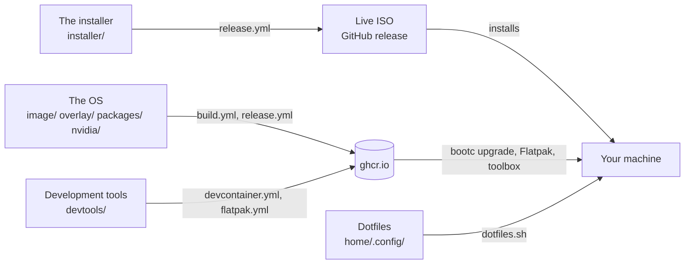

# fedora-bootc

A personal Fedora 44 desktop, built as a bootable container image and
installed and updated by [bootc](https://bootc.dev/). It boots systemd-boot and
a sealed UKI ([composefs backend](https://bootc.dev/bootc/experimental-composefs.html))
signed with your own Secure Boot key, and only accepts cosign-signed updates.

Four parts, each built and shipped on its own:



## The OS

`image/` (the build steps), `overlay/` (files copied onto the image),
`packages/`, `nvidia/`

greetd with noctalia-greeter, five Wayland sessions (niri, labwc, sway, river,
wayfire) running the [Noctalia](https://noctalia.dev) shell, ghostty and fish,
podman and docker, QEMU with Virtual Machine Manager, XRDP. More, with remote
desktop, VMs and NVIDIA: [docs/os.md](docs/os.md).

```sh
sudo bootc upgrade     # stage the newest image for the next boot (--apply: reboot into it)
sudo bootc rollback    # back to the previous one (also in the boot menu)
sudo bootc status
sudo bootc switch ghcr.io/lucarickli/fedora-bootc:latest-uki  # once, after installing a local build
```

| Tag | Image |
|---|---|
| `latest-uki` | sealed and signed; what the ISO installs (`nvidia-uki` on GTX 16 / RTX 20 and newer) |
| `nvidia-uki` | the same, with the NVIDIA driver |
| `latest`, `nvidia` | unsealed (kernel in place) |
| `build-<sha>`, `build-<sha>-uki`, ... | one per build, for testing it |

A release every Monday; machines also update themselves. Releases, updates,
scanning and CI: [docs/updates.md](docs/updates.md). Also: Secure Boot and TPM2
([docs/secureboot-tpm2.md](docs/secureboot-tpm2.md)), rescue
([docs/rescue.md](docs/rescue.md)), pulling through a cache
([docs/pull-through-cache.md](docs/pull-through-cache.md)), enterprise Wi-Fi
([docs/enterprise-wifi.md](docs/enterprise-wifi.md)).

## The installer

`installer/`

A live ISO with a graphical wizard, which installs `latest-uki` (`nvidia-uki`
on a GTX 16 / RTX 20 series or newer). Take it from a
[release](https://github.com/lucarickli/dotfiles/releases) or build it with
`just iso`, boot it and follow the wizard. Without the ISO, `bootc install`
from any live USB: [docs/install.md](docs/install.md). Afterwards, enroll your
Secure Boot keys and bind LUKS to the TPM:
[docs/secureboot-tpm2.md](docs/secureboot-tpm2.md).

## Dotfiles

`home/.config/`, `dotfiles.sh`

Never part of the image. On a new machine:

```sh
git clone https://github.com/lucarickli/dotfiles.git
cd dotfiles
./dotfiles.sh
flatpak install -y flathub $(grep -vE '^\s*(#|$)' packages/flatpaks.txt)
```

`dotfiles.sh` links `home/.config` into `~/.config` (GNU Stow), asking before
it replaces anything. The Flatpaks: Firefox, Remmina and Bazaar (the app
store).

## Development tools

`devtools/`

Go, Deno, Rust and Protocol Buffers with their language servers and linters,
the Kubernetes and Talos CLIs, sops, age, trivy, gh and fish, plus the VS Code
extensions for them, pinned in `tools.txt` and `extensions.txt`. They are not
on the host: the VS Code Flatpak (`ghcr.io/lucarickli/code`, its terminal is
a development environment) and the dev container
(`ghcr.io/lucarickli/devcontainer`) carry them.

```sh
just flatpak && just flatpak-install   # build VS Code locally and install it for your user
toolbox create --image ghcr.io/lucarickli/devcontainer:latest dev
```

In a project, `.devcontainer/devcontainer.json`:
`{ "image": "ghcr.io/lucarickli/devcontainer:latest" }`. More, with ports and
offline use: [docs/devtools.md](docs/devtools.md).

## Building it

`Containerfile`, `Justfile`, `scripts/` (helpers the recipes run). Needs
rootless `podman` and `just`; the VM recipes also `bcvk`, `qemu` and OVMF.

```sh
just build           # sealed image: localhost/fedora-bootc:latest
just build-nvidia    # NVIDIA variant (`just build-nvidia closed` for GTX 900/1000)
just qcow2           # install it into output/disk.qcow2
just demo-user       # optional: demo/demo login, on that disk only
just vm              # boot it; the greeter listing five sessions is the pass
just vm-secureboot   # the same with Secure Boot enforcing
just check           # validate the dotfiles and script syntax
just iso             # live installer: output/fedora-bootc-live.iso
```

The composefs backend is experimental: boot-test every build in a VM before it
goes near real hardware. `just --list` shows the rest. Your own copy, with
your keys and CI: [docs/fork.md](docs/fork.md). `keys/` holds the Secure Boot
certificates and the cosign public key, `repart.d/` the partition layout for
manual installs.
