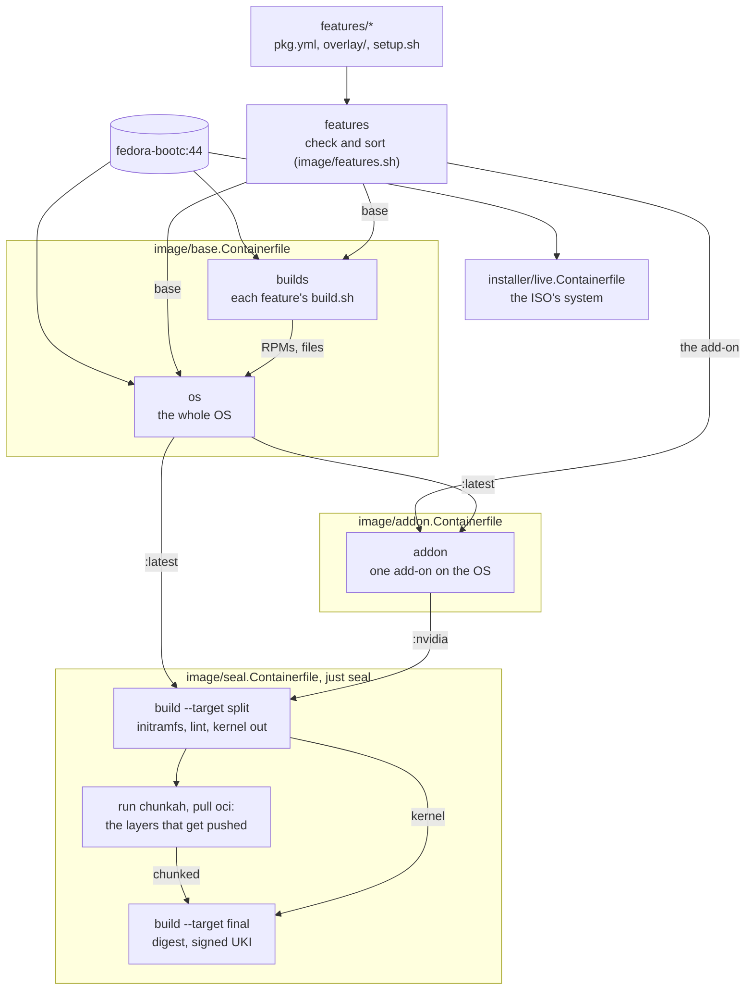
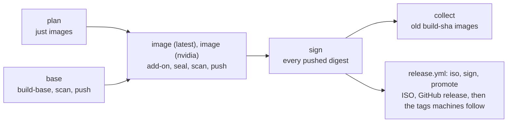

# How the build works

Four Containerfiles, run by the [`Justfile`](../../Justfile)'s recipes, the
same way locally and in CI. The features they build from are in
[`features/`](../../features/README.md).

| File | Builds | Tag (`localhost/fedora-bootc`) |
|---|---|---|
| [`image/base.Containerfile`](../../image/base.Containerfile) | the OS, unsealed | `latest` |
| [`image/addon.Containerfile`](../../image/addon.Containerfile) | an add-on on top of it | `<add-on>`, such as `nvidia` |
| [`image/seal.Containerfile`](../../image/seal.Containerfile) | any of those, sealed into a signed UKI | `<name>-uki` |
| [`installer/live.Containerfile`](../../installer/live.Containerfile) | the live ISO's system | `live` |

`just build` runs `build-base`, then `seal latest`. `just build nvidia
[closed]` (or `just build-nvidia`) runs `build-base`, `build-addon nvidia`
and `seal nvidia`. The tags are the registry's ([updates.md](updates.md)).

## Stages

**`features`** runs [`image/features.sh`](../../image/features.sh): it checks
every `pkg.yml`, the `requires` between features and that no two features
ship the same file, then sorts the features into the base and one set per
add-on. Each later step gets only its part, which is what keeps the cache
useful (below).

**`builds`** runs every base feature's `build.sh`
([`image/builds.sh`](../../image/builds.sh)): what Fedora does not package,
built from pinned upstream versions (noctalia-greeter as an RPM, shimmy as a
binary). It starts from the same base as the image, so the results link
against the libraries the image ships, and it is thrown away, so no
toolchain reaches the image. A new build needs no change outside its
feature's folder.

**`os`** is the whole OS, an ordinary bootc image with its kernel in place:

1. The comps groups (Workstation's base set, without GNOME): gigabytes that
   rarely change, in a layer of their own.
2. [`packages.sh`](../../image/packages.sh): each feature's `pre-install.sh`,
   then every package of every base feature in one dnf transaction (plus the
   RPMs the builds made), then each `post-install.sh`. The expensive layer.
3. [`bootloader.sh`](../../image/bootloader.sh): GRUB and bootupd out,
   systemd-boot in, signed with the Secure Boot key.
4. The base features' `overlay/` trees, the files the builds made and the
   cosign public key are copied in.
5. [`finalize.sh`](../../image/finalize.sh): the features' systemd presets,
   each `setup.sh` (its setup, then its checks), then checks of the image as
   a whole.

**`addon`** runs steps 2, 4 and 5 again on top of the OS, for the add-on
`ADDON` names; `ADDON_FLAVOR` reaches its scripts. For nvidia: RPM Fusion's
driver, its kernel module built and signed against the image's kernel,
open or closed modules by flavor.

[`installer/live.Containerfile`](../../installer/live.Containerfile), the
live ISO's system, starts from the plain Fedora base, not the OS: the
installer pulls the real image from the registry
([`installer/`](../../installer/)).

## Sealing

`just seal <name> [src]` seals a local bootc image (`src`, by default
`:<name>`) into `:<name>-uki` in three commands:

1. `podman build --target split`: [`initramfs.sh`](../../image/initramfs.sh)
   rebuilds the initramfs, `bootc container lint` runs, and the kernel and
   initramfs move out of the rootfs (`:<name>-split`, used by image ID from
   here on).
2. `podman run` of the pinned chunkah, with the split image read-only, an
   empty directory under `${TMPDIR:-/var/tmp}` (about 10 GB) and no network,
   rechunks the rootfs into the layers that get pushed; `podman pull oci:`
   imports them.
3. `podman build --target final`, with the import and the split image as
   build contexts: `uki` seals the composefs digest of the imported layers
   and the `kargs.d` kernel arguments into a UKI signed with the Secure Boot
   key ([`uki.sh`](../../image/uki.sh)); `final` is the import plus that UKI
   in `/boot/EFI/Linux/`.

The digest has to come from the import: those are the layers `bootc
install` pulls, and with a digest computed from a build stage the UKI
refuses to boot. `image/seal.Containerfile` and the `seal` recipe have the
details.

## What reruns

Locally, each step is a cached layer; a change reruns its step and
everything after it. A CI job starts without a cache and builds what it
needs from scratch.

| Changed | Reruns |
|---|---|
| nothing | chunkah (seconds, the same layers); the rest is cached (the UKI step once more after a new split image) |
| a feature's `setup.sh` or `overlay/` (except `etc/yum.repos.d/`) | `finalize.sh` (seconds), then each add-on from its package step, then the seals |
| a package list, a `.repo` file, `pre-install.sh` or `post-install.sh` | the package step (minutes) |
| a feature's `build.sh` or the files next to it | every build, then the package step if a built RPM changed |
| an add-on's folder (`features/nvidia/`) | only that add-on's image and its seal |
| the Secure Boot certificate (a new key) | the steps that sign: `bootloader.sh`, an add-on's package step, the UKI |
| `image/initramfs.sh` | each seal from its split step; the unsealed images stay as they are |
| `image/uki.sh` | the UKI step alone |
| the Fedora base (daily) | everything |
| docs, `home/`, CI files | nothing: `.containerignore` keeps them out |

## Keys

The private keys live outside the checkout, in the key directory
(`~/.local/share/fedora-bootc/keys`, [keys/README.md](../../keys/README.md)).
The Secure Boot db key and its certificate are podman secrets, mounted only
into the three steps that sign: `bootloader.sh`, an add-on's package step
(nvidia's modules) and `uki`. No step mounts the build context
(`just check-syntax` checks), and `.containerignore` keeps `keys/` out of it,
`cosign.pub` aside. The cosign key reaches no build: CI signs after the
push, in a job of its own ([updates.md](updates.md#signing)).

## What fails a build

- `features.sh`: a broken `pkg.yml`, a missing requirement, a file shipped
  twice, a `build.sh` that cannot run or sits in an add-on, an add-on named
  after a tag that is taken.
- `builds.sh`: a `build.sh` that fails, or two builds making the same file
  or RPM.
- A feature's checks (the end of its `setup.sh`) and `finalize.sh`'s
  image-wide ones: a built file that is also in an overlay, services, a
  private key left in the image, what the comps excludes keep out.
- `initramfs.sh`: plymouthd or its theme missing from the initramfs, and on
  the nvidia add-on the nvidia modules (early KMS).
- `bootc container lint`.
- In CI, before every seal: a chunkah pin its release workflow did not sign
  (`just verify-chunkah`). Before every push: the scan
  ([updates.md](updates.md#scanning)).

## Locally and in CI

| | Locally | CI ([`build.yml`](../../.github/workflows/build.yml)) |
|---|---|---|
| which images | `just images` | job `plan`: the matrix, and how many builds `collect` keeps |
| unsealed OS | `just build-base` | job `base`: built once per run, pushed as `build-<sha>` |
| unsealed add-on | `just build-addon nvidia [closed]` | in its `image` job, pushed as `build-<sha>-nvidia` |
| sealed | `just build`, `just build nvidia [closed]` | job `image (<name>)`, one per image: `just build <name>` on the pushed base (`BASE_IMAGE`), pushed as `build-<sha>[-<add-on>]-uki` |
| live ISO | `just build-live`, `just iso` | `release.yml`, and pull requests that touch it |

Each push goes through `.github/actions/publish` to one immutable
`build-<sha>...` tag. A push to main runs `build.yml` alone; the weekly
`release.yml` runs it first, then `iso`, `sign` (the live image) and
`promote`. Pull requests run `plan` and the `image` jobs, each building its
own OS with a throwaway Secure Boot key, and push nothing. Tags, signing and
releases: [updates.md](updates.md).
