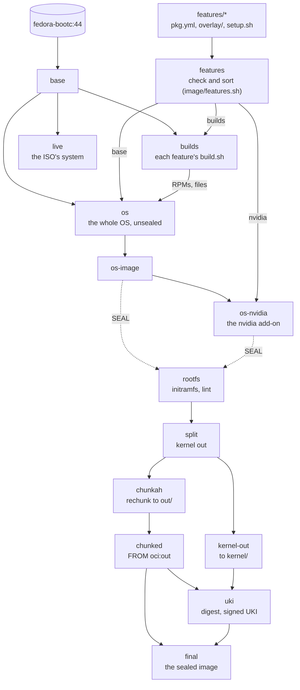
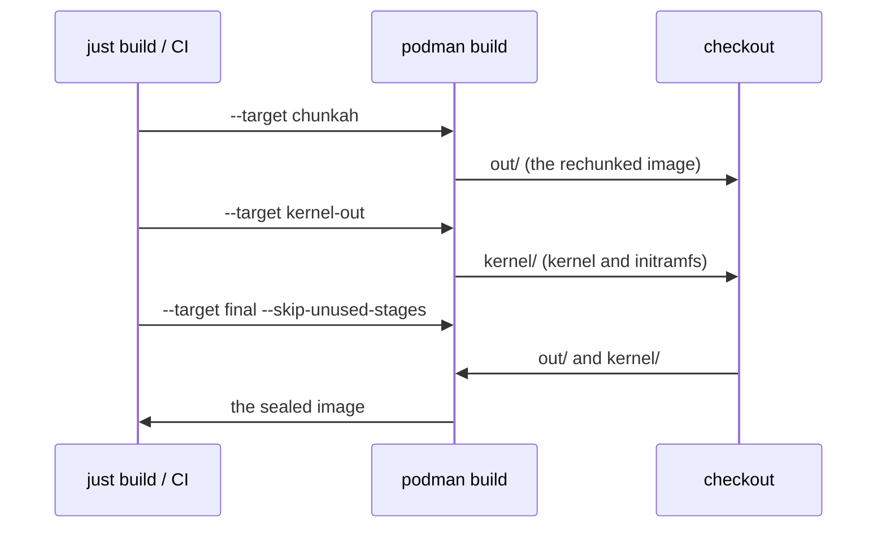
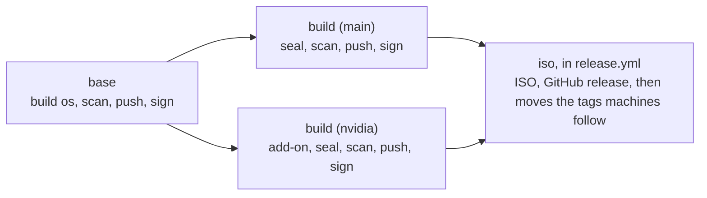

# How the build works

One [`Containerfile`](../../Containerfile) builds everything: the OS image, its
NVIDIA variant, both sealed into a signed UKI, and the live ISO's system.
`just build` and CI run the same stages; the features they build from are in
[`features/`](../../features/README.md).

## Stages

**`features`** runs [`image/features.sh`](../../image/features.sh): it checks
every `pkg.yml`, the `requires` between features and that no two features
ship the same file, then sorts the features into the base and one set per
add-on. Each later step gets only its part, which is what keeps the cache
useful (below).

**`builds`** runs every base feature's `build.sh`
([`image/builds.sh`](../../image/builds.sh)): what Fedora does not package,
built from pinned upstream versions (noctalia-greeter as an RPM, shimmy as a
binary). It starts from the same base as the image, so the results link
against the libraries the image ships, and it is thrown away, so no
toolchain reaches the image. A new build needs no Containerfile change.

**`os`** is the whole OS, an ordinary bootc image with its kernel in place:

1. The comps groups (Workstation's base set, without GNOME): gigabytes that
   rarely change, in a layer of their own.
2. [`packages.sh`](../../image/packages.sh): each feature's `pre-install.sh`,
   then every package of every base feature in one dnf transaction (plus the
   RPMs the builds made), then each `post-install.sh`. The expensive layer.
3. [`bootloader.sh`](../../image/bootloader.sh): GRUB and bootupd out,
   systemd-boot in, signed with the Secure Boot key.
4. The base features' `overlay/` trees, the files the builds made and the
   cosign public key are copied in.
5. [`finalize.sh`](../../image/finalize.sh): the features' systemd presets,
   each `setup.sh` (its setup, then its checks), then checks of the image as
   a whole.

**`os-nvidia`** runs steps 2, 4 and 5 again on top of `os-image`, for the
nvidia add-on alone: RPM Fusion's driver, its kernel module built and signed
against the image's kernel.

**Sealing** starts from whichever of the two `SEAL` names. `rootfs` rebuilds
the initramfs and runs `bootc container lint`; `split` moves the kernel and
initramfs out of the rootfs; `chunkah` rechunks it into the canonical layers
that get pushed; `uki` computes the composefs digest of exactly those layers
and seals it, with the kernel arguments from `kargs.d`, into a UKI signed
with the Secure Boot key; `final` is the rechunked image plus that UKI in
`/boot/EFI/Linux/`. The digest has to come from the rechunked layers: one
computed from the build stage does not match what `bootc install` pulls, and
the UKI then refuses to boot.

**`live`** starts from the plain base, not the OS: the installer pulls the
real image from the registry ([`installer/`](../../installer/)).

## Three podman runs

`chunkah` writes the rechunked image to `out/` in the checkout, and `chunked`
reads it back with `FROM oci:out`. podman cannot see that dependency, so
[`just build`](../../Justfile) (`_build`) and CI split the build there:

The second and third runs use `--pull=missing`, so a base image republished
in between (`fedora-bootc:44` moves daily) cannot give `kernel/` a different
rootfs than `out/`. The third needs nothing from the rootfs stages and skips
them.

## What reruns

Locally, each step is a cached layer; a change reruns its step and
everything after it. A CI job starts without a cache and builds what it
needs from scratch.

| Changed | Reruns |
|---|---|
| a feature's `setup.sh` or `overlay/` (except `etc/yum.repos.d/`) | `finalize.sh` (seconds), then the seal |
| a package list, a `.repo` file, `pre-install.sh` or `post-install.sh` | the package step (minutes) |
| a feature's `build.sh` or the files next to it | every build, then the package step if a built RPM changed |
| `features/nvidia/` | only the NVIDIA image's steps |
| the Fedora base (daily) | everything |
| docs, `home/`, CI files | nothing: `.containerignore` keeps them out |

## Keys

The Secure Boot key is a podman secret, mounted only into the steps that
sign: `bootloader.sh`, the nvidia add-on's package step (which also removes
it again) and `uki`. It is not in the build context (`.containerignore`). In
CI it lives outside the checkout. `just build` and `just build-nvidia` mount
the checkout for `out/` and `kernel/`, so every step of a local sealed build
can read `keys/`, the cosign private key included. In CI the cosign private
key never enters a build: CI signs each image after pushing it.

## What fails a build

- `features.sh`: a broken `pkg.yml`, a missing requirement, a file shipped
  twice, a `build.sh` that cannot run or sits in an add-on.
- `builds.sh`: a `build.sh` that fails, or two builds making the same file
  or RPM.
- A feature's checks (the end of its `setup.sh`) and `finalize.sh`'s
  image-wide ones: a built file that is also in an overlay, services, a
  private key left in the image, what the comps excludes keep out.
- `initramfs.sh`: plymouthd or its theme missing from the initramfs, and on
  the NVIDIA variant the nvidia modules (early KMS).
- `bootc container lint`.
- In CI, before every push: the scan ([updates.md](updates.md#scanning)).

## Locally and in CI

| | Locally | CI ([`build.yml`](../../.github/workflows/build.yml)) |
|---|---|---|
| unsealed OS | `just build-base` | job `base`: built once per run, pushed as `build-<sha>` |
| sealed | `just build`, `just build-nvidia [closed]` | one job per variant, each starting from that pushed base (`OS_BASE`) |
| unsealed NVIDIA | `podman build --target os-nvidia` with the key secrets | in the nvidia job, pushed as `build-<sha>-nvidia` |
| live ISO | `just build-live`, `just iso` | `release.yml`, and pull requests that touch it |

A push to main runs `base` and `build` and stops there. The weekly
`release.yml` runs those two jobs again as its first step, then `iso`.

Pull requests build and scan without the `base` job and push nothing. Tags,
releases and what machines follow: [updates.md](updates.md).
